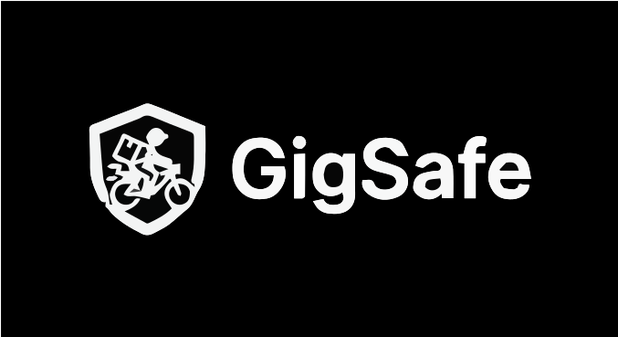
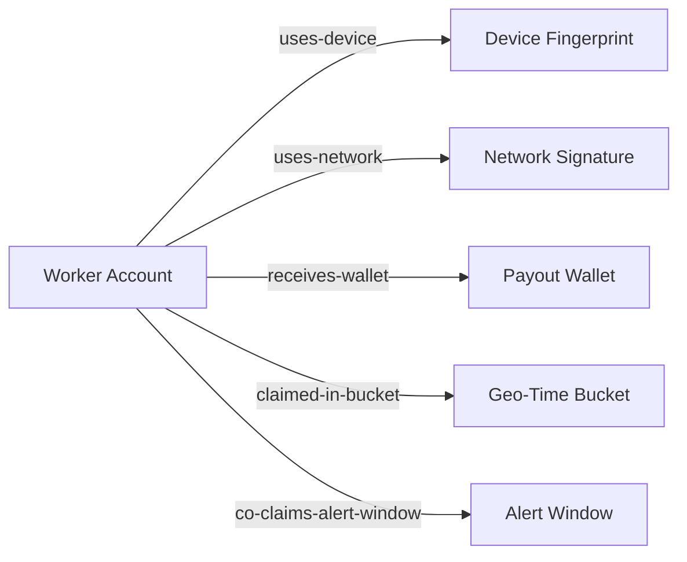

<p align="center">
    
</p>

<h1 align="center">Adversarial Defense &amp; Anti-Spoofing Strategy</h1>

<p align="center">
    
    
    
    
</p>

<p align="center"><strong>Production-minded anti-spoofing controls for high-volume parametric payout systems.</strong></p>

> A coordinated fraud ring of 500 delivery workers in a tier-1 city used Telegram coordination, GPS spoofing apps, and synchronized claim timing to appear stranded inside severe-weather zones. The objective was not isolated abuse but liquidity pool exhaustion through high-volume, low-friction false auto-payouts in one alert window. This defense architecture treats the incident as an adversarial system attack and uses multi-signal trust scoring, graph-linked ring detection, and fairness-preserving claim handling to prevent pool drain without punishing legitimate workers.

### Security Design Objective

The anti-spoofing strategy must satisfy three constraints at the same time:

1. Distinguish genuinely stranded workers from GPS spoofers under active attack conditions.
2. Detect coordinated fraud rings using cross-entity evidence, not only per-account anomalies.
3. Preserve fair treatment for honest workers with degraded telemetry during severe weather.

### 1) Differentiating a Genuine Stranding Event from GPS Spoofing

A claim is never trusted on GPS coordinates alone. The decision engine computes a claim trust score from six evidence families and combines it with inherited ring risk from linked entities.

Evidence families:

1. Device integrity: mock-location detection, runtime attestation, emulator or rooted-device indicators.
2. Spatiotemporal plausibility: speed continuity, heading continuity, impossible-jump checks, zone entry and exit coherence.
3. Cross-signal corroboration: weather severity timing, network quality traces, and app event continuity.
4. Behavioral baseline drift: payout-window-only behavior, sudden pattern changes, repeated high-risk timing.
5. Identity and payout linkage: account age, payout wallet reuse, high-risk link density.
6. Ring inheritance: cluster-level risk propagated from graph-linked entities.

#### Diagram A: Claim Trust Decision DAG (Threshold-Labeled)

```mermaid
flowchart TD
    A[Claim Received] --> B{Policy Active?}
    B -- "No" --> R1[Red Tier: 0% payout\nAction: Reject (ineligible policy)]
    B -- "Yes" --> C{Severe Event in Claimed Zone?}
    C -- "No" --> R2[Red Tier: 0% payout\nAction: Reject (no trigger event)]
    C -- "Yes" --> D{Device Integrity Score >= 0.70?}
    D -- "No" --> E{Degraded Telemetry Triggered?}
    D -- "Yes" --> F{Spatiotemporal Plausibility Score >= 0.65?}
    F -- "No" --> E
    F -- "Yes" --> G{Cross-Signal Corroboration Score >= 0.60?}
    G -- "No" --> E
    G -- "Yes" --> H{Inherited Ring Risk < 0.40?}
    H -- "Yes" --> G1[Green Tier: 100% payout\nAction: Auto-pay]
    H -- "No (>= 0.40)" --> I{Inherited Ring Risk >= 0.60?}
    I -- "Yes" --> R3[Red Tier: 0% payout\nAction: Hold + expedited review]
    I -- "No (0.40 to 0.59)" --> A1[Amber Tier: 40% payout\nAction: Provisional + async review]
    E -- "No" --> R4[Red Tier: 0% payout\nAction: Hold for evidence]
    E -- "Yes" --> A2[Amber-Degraded Tier: 40% payout\nAction: Provisional + 6h evidence window]
```

### 2) Data Beyond GPS for Coordinated Fraud Ring Detection

The fraud model uses a heterogeneous evidence graph. Each claim is mapped to entities and relationships that are difficult to spoof consistently across a large coordinated group.

#### Diagram B: Entity-Edge Schema for Ring Detection



| Rule ID | Pattern | Time Window | Threshold | Risk Points | Action |
|---|---|---|---|---:|---|
| R1 | Worker -> uses-device -> Device Fingerprint fan-in burst | 90 minutes during active alert | >= 12 unique workers on same device fingerprint; >= 70% are first claim in 30 days | 35 | Mark linked component high risk; if combined with any other rule, force Red hold |
| R2 | Worker -> receives-wallet -> Payout Wallet convergence | 24 hours | >= 8 workers sharing one wallet; median account age < 21 days | 30 | Freeze incremental payouts for linked wallet cluster; escalate to ring review |
| R3 | Worker -> claimed-in-bucket -> Geo-Time synchronization | 5-minute burst within alert | >= 10 workers entering same red-alert area with trajectory similarity >= 0.85 | 25 | Move all linked claims to at least Amber; compute cluster risk immediately |
| R4 | Geo-time sequence impossible mobility and template reuse | 1 shift (per worker) + cross-worker comparison | Per worker: >= 2 jumps > 8 km in < 4 min; or >= 6 workers with timestamp jitter <= 2 sec on near-identical paths | 20 | Require enhanced verification token; block Green auto-pay for linked group |
| R5 | Worker -> uses-network -> Network Signature opportunism | 30 minutes | >= 15 claims on same network signature group; alert-window claim rate >= 6x baseline | 20 | Set cluster floor to Amber; if total ring risk >= 60, force Red hold |

Cluster risk scoring:

1. Ring risk = min(100, sum(triggered rule risk points)).
2. 0 to 39: low ring risk (Green eligible if claim trust is strong).
3. 40 to 59: medium ring risk (Amber minimum).
4. 60 to 74: high ring risk (Red hold + expedited review).
5. 75 to 100: critical ring risk (Red hold + wallet or device containment actions).

### 3) UX Workflow for Flagged Claims Without Penalizing Honest Workers

Flag handling is confidence-tiered, explainable, and SLA-bound. The worker sees a clear status, evidence requirements, and timeline instead of opaque fraud labels.

Tier behaviors:

1. Green: immediate 100% payout.
2. Amber: immediate 40% provisional payout, asynchronous review.
3. Red: payout hold, expedited manual review with reason codes.

### Degraded Telemetry Protection Protocol

This protocol handles the hardest fairness case: legitimate workers stranded in severe conditions with weak or unstable telemetry.

#### Trigger Conditions (4 total)

A claim enters degraded telemetry mode when any 2 of the following 4 conditions are true during the claim window:

1. Battery level < 12%.
2. GPS accuracy worse than 150 meters for >= 8 minutes.
3. Data packet loss > 40% for >= 10 minutes or repeated disconnects.
4. Offline telemetry gap >= 8 minutes while severe alert is active.

#### Amber-Degraded Lane Definition

1. Eligibility: policy is active, severe event is confirmed for claimed zone, and no hard-fraud composite hit (R1 + R2 in same claim context).
2. Immediate action: release 40% provisional payout within 10 minutes.
3. Claim state: Amber-Degraded with visible evidence checklist and ETA.

#### 6-Hour Alternative Evidence Window

The claimant is granted a 6-hour recovery window to submit or automatically sync alternative evidence:

1. Post-reconnect signed app event log continuity.
2. Last trusted location and reconnect location continuity check.
3. Coarse network handoff continuity (cell or network signature transitions).
4. Platform order-timeline consistency once data sync resumes.
5. Zone-level weather and traffic corroboration matching claim period.

#### SLA and SLA-Breach Auto-Upgrade Rule

1. Review SLA target: 2 hours.
2. Review SLA maximum: 12 hours.
3. If 12-hour maximum is breached and no hard-fraud signal is confirmed, provisional payout auto-upgrades from 40% to 70%.
4. Final settlement decision is logged with explicit reason codes and evidence references.

#### 14-Day Rolling Cap (Exact Numbers)

1. Each worker is auto-eligible for 1 Amber-Degraded provisional event per rolling 14-day window with no extra friction.
2. A second Amber-Degraded event in the same 14-day window remains eligible but requires enhanced post-sync evidence before final settlement.
3. At 3 or more Amber-Degraded events in a rolling 14-day window, the account is routed to enhanced verification mode; claims are not auto-denied, but Green auto-pay is disabled until trust is restored.

### Operational Decision Policy

To answer the three challenge questions directly:

1. Genuine stranded vs spoofer: differentiated through thresholded multi-signal trust scoring plus inherited ring risk, not GPS-only checks.
2. Data beyond GPS: device, network, wallet, geo-time, and alert-window relationships are fused into a ring graph with deterministic trigger rules R1 to R5.
3. Fair flagged-claim UX: Green, Amber, and Red tiers are coupled with an Amber-Degraded protection lane, 6-hour alternate evidence window, and SLA-bound payout safeguards.

### Scope Alignment With Phase 1

This section is an immediate hardening roadmap for the beta attack surface. It does not claim that every anti-fraud control is already deployed in the current simulation-first prototype; it defines the security and fairness controls required before production-scale automated payouts are enabled.